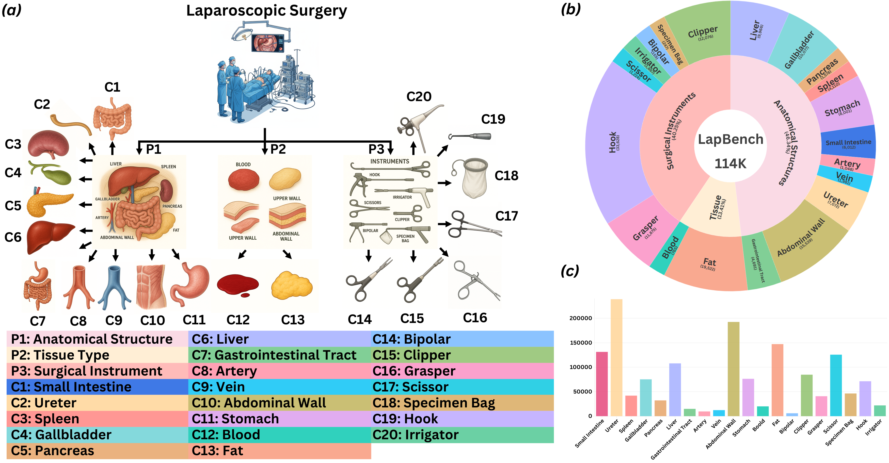
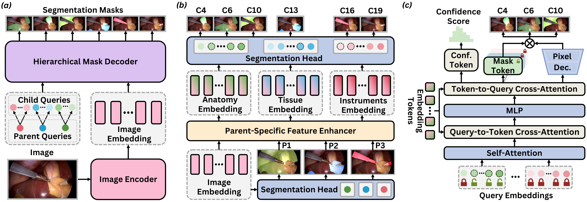

# LapFM: A Laparoscopic Segmentation Foundation Model via Hierarchical Concept Evolving Pre-training

[[`arXiv`]()] 

-------------------------------------------



## 📰News

- **[2025.12.07]** We have released the code for LapFM!
## 🛠Setup

```bash
git clone https://github.com/xq141839/LapFM.git
cd LapFM
conda create -f LapFM.yaml
```

**Key requirements**: Cuda 12.2+, PyTorch 2.4+

## 📚Data Preparation
- **CholecSeg8k**: [https://www.kaggle.com/datasets/newslab/cholecseg8k](https://www.kaggle.com/datasets/newslab/cholecseg8k)
- **Dresden**: [https://www.kaggle.com/datasets/anindyamajumder/the-dresden-surgical-anatomy-dataset](https://www.kaggle.com/datasets/anindyamajumder/the-dresden-surgical-anatomy-dataset)
- **EndoScapes**: [https://github.com/CAMMA-public/Endoscapes](https://github.com/CAMMA-public/Endoscapes)
- **M2caiSeg**: [https://www.kaggle.com/datasets/salmanmaq/m2caiseg](https://www.kaggle.com/datasets/salmanmaq/m2caiseg)
- **AutoLaparoT3**: [https://autolaparo.github.io/](https://autolaparo.github.io/)

The data structure is as follows.
```
LapFM
├── datasets
│   ├── image
│     ├── cholecseg8k_001.png
|     ├── ...
|   ├── npy
│     ├── cholecseg8k_001.npy
|     ├── ...
|   ├── channel_specific_meta_cholecseg8k_split.json
|   ├── ...
```
The json structure is as follows.

    { 
     "train": ['cholecseg8k_001'],
     "valid": ['cholecseg8k_002'],
     "test":  ['cholecseg8k_003'] 
     }

## 🎪Quickstart
* Train the Co-Seg++ with the parent categories:
```python
python train_parent.py --sam_pretrain pretrain/$SAM2 CHECKPOINT$
```

## 📜Citation
If you find this work helpful for your project, please consider citing the following paper:
```
```

## Acknowledgements

* [SAM2](https://github.com/facebookresearch/sam2)
* [Medical-SAM-Adapter](https://github.com/SuperMedIntel/Medical-SAM-Adapter)
* [CAMMA](https://github.com/CAMMA-public/camma_dataset_overlaps)

